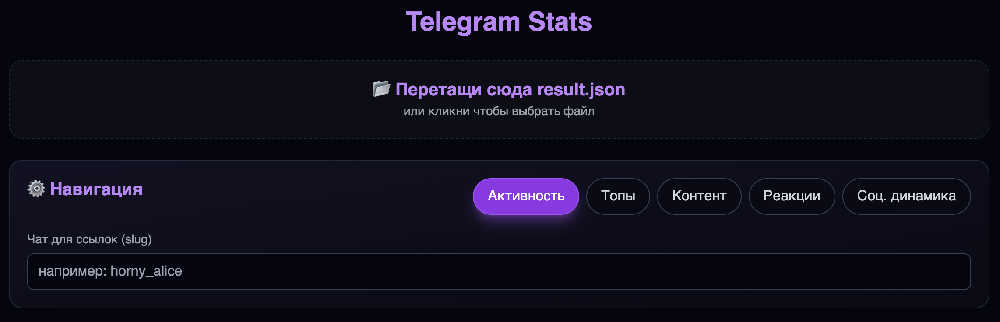

# Telegram Stats



## Локальная разработка (без Docker)
```bash
npm install
npm run dev
```
Открой URL из консоли (обычно http://localhost:5173). Перетащи файл `result.json` из экспорта Telegram.

## Проверка качества
```bash
npm run ci
```

CI включает `typecheck`, `lint`, `test` и `build`.

## Что улучшено
- Парсинг и предобработка больших JSON вынесены в Web Worker (меньше фризов UI).
- Добавлены фильтры по датам, автору и минимальному числу реакций.
- Исправлены проблемы корректности: мутация массива в топах, коллизии авторов по имени, единая ISO-логика недель.
- Оптимизирован социальный граф: уменьшены лишние линейные поиски по узлам.
- Добавлены unit-тесты на критичные части парсинга и статистики.

## Экспорт чата
Telegram Desktop → Выбери чат → Дополнительно → Экспорт истории чата → Формат JSON.
